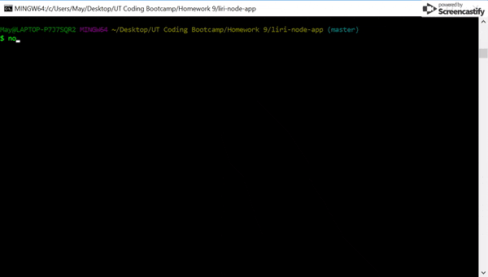
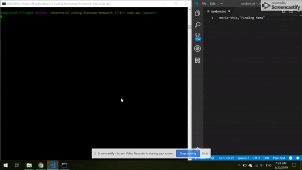

# Liri-bot

A language Interpretation and Recognition Interface that uses command line in node to give you back data

LIRI will search Spotify for songs, Bands in Town for concerts and OMDB for movies
   
## Getting Started
1. Clone this project down to your computer and install the necessary npm packages
```
npm install
```

2. Obtain a spotify key by following the steps in the [Node-Spotify-API](https://www.npmjs.com/package/node-spotify-api) documentation.

3. Next, create a file named `.env`, add the following to it, replacing the values with your API keys (no quotes) once you have them:

```js
# Spotify API keys

SPOTIFY_ID=your-spotify-id
SPOTIFY_SECRET=your-spotify-secret

```

* This file will be used by the `dotenv` package to set what are known as environment variables to the global `process.env` object in node. These are values that are meant to be specific to the computer that node is running on, and since we are gitignoring this file, they won't be pushed to github &mdash; keeping our API key information private.

* If someone wanted to clone your app from github and run it themselves, they would need to supply their own `.env` file for it to work.

## How to use LIRI

* LIRI is able to take in 4 commands utilizing node.js
    * concert-this
    * spotify-this-song
    * movie-this
    * do-what-it-says

## What each command does
1. 'node liri.js concert-this \<band or artist name\>'
    * Displays a current up-to-date list of results of where the band or artist is scheduled to perform
```
example: node liri.js concert-this Anberlin
```
<br>

2. 'node liri.js spotify-this-song \<song name\>'
    * Displays the top 3 results of the song name
    * If there is no song name inserted, the search will default to "The Sign" by Ace of Base
```
example: node liri.js spotify-this-song Beauty and the Beast
```
<br>

3. 'node liri.js movie-this \<movie title\>'
    * Displays the following information
        * Title of the movie
        * Year of the movie
        * IMDB Rating of the movie
        * Rotten Tomatoes Rating of the movie
        * Where was the movie produced
        * Language of the movie
        * Plot of the movie
        * Actors in the movie
    * If there is no movie title inserted, the search will default to Mr. Nobody
```
example: node liri.js movie-this Spirited Away
```
<br>


4. 'node liri.js do-what-it-says'
    * Takes the text from random.txt and runs the song through the spotify-this-song command
    * Edit the text in random.txt to test out the feature for spotify-this-song and concert-this!
```
example: node liri.js do-what-it-says
```
<br>

* In addition to logging out your results to the terminal, it will log out your inputs and results in a log.txt file!

## Technology Used:

   * [Node.js](https://nodejs.org/en/)
   * [Node-Spotify-API](https://www.npmjs.com/package/node-spotify-api)
   * [Axios](https://www.npmjs.com/package/axios)
     * Axios will grab data from the [OMDB API](http://www.omdbapi.com) and the [Bands In Town API](http://www.artists.bandsintown.com/bandsintown-api)
   * [Moment](https://www.npmjs.com/package/moment)
   * [DotEnv](https://www.npmjs.com/package/dotenv)

## Where users can get help with this project
If you need assistance, please reach out to this email with your questions and concerns: <dangmaryk@gmail.com>.

## Who maintains and contributes to this project 
Mary Dang  
Github Repository link: <https://github.com/mkd454/liri-node-app>
Portfolio link: <https://mkd454.github.io/Portfolio-V2/>

## Acknowledgments

* Thanks to The Coding Boot Camp at UT Austin


- - -